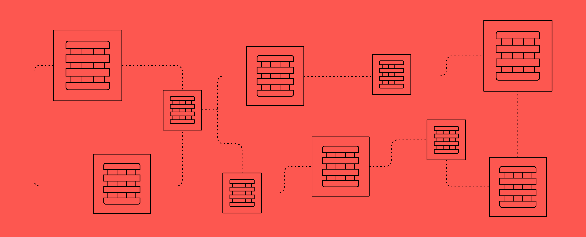

# Serverless Application using AWS-CDK



## Introduction
With serverless computing, infrastructure management tasks like capacity provisioning and patching are handled by AWS, so we can focus on only writing code that serves. Serverless services like AWS Lambda comes with automatic scaling and built-in high availability features.

## AWS Services used by the Application
The following services are used to create a serverless RESTApi using various Amazon Web Services.

 - AWS Lambda Functions
 - AWS API Gateway
 - AWS System Manager Service
 - AWS Subscription Filter
 - AWS Managed Policy
 - AWS Log Groups
 - AWS Cloud Formation Stacks
 - AWS IAM

## Usage 
### Installation Process

Install AWS CDK

```bash
npm install -g aws-cdk
```

Configure AWS credentials

```bash
aws configure
```

### Build

```bash
npm run build
cdk bootstrap
cdk synth --quiet
```

### Deploy

```bash
cdk deploy --all
```

## Contributing
Pull requests are welcome. For major changes, please open an issue first to discuss what you would like to change.

## License
[MIT](https://choosealicense.com/licenses/mit/)